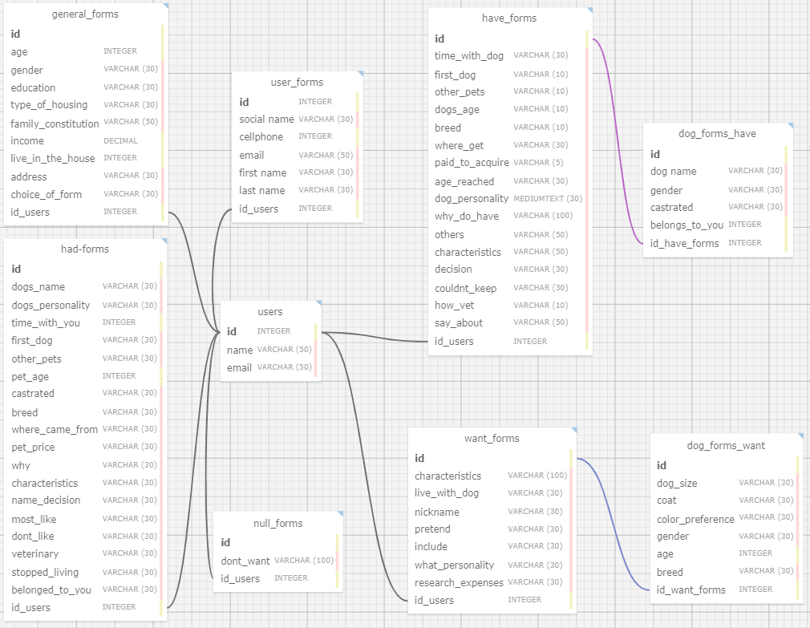

# Documentação do Modelo Relacional - Projeto Abandono Zero

## Descrição Geral

Esta é a representação visual da estrutura relacional do projeto Abandono Zero, cujo objetivo é gerenciar eficazmente as informações dos usuários e suas respostas nos formulários. A modelagem apresenta as entidades, seus atributos e os relacionamentos entre elas, proporcionando uma visão clara e organizada do banco de dados.

## Entidades

### users
- **Descrição**: Armazena informações sobre os usuários e se relaciona com as outras entidades.
- **Chave Primária**: id
- **Relacionamentos**:
  - **general_forms (1:1)**: Cada usuário pode ter apenas um formulário geral.
  - **have_forms (1:N)**: Cada usuário pode ter vários formulários de cães que já possui.
  - **has_forms (1:N)**: Cada usuário pode ter vários formulários de cães que já teve.
  - **want_forms (1:N)**: Cada usuário pode ter vários formulários de cães que deseja adotar.
  - **null_forms (1:N)**: Cada usuário pode ter vários formulários de cães que nunca conviveu ou não tem vontade de ter.
- **Atributos**:
    - **id**: Chave primária, identificador único.
    - **name**: Nome do usuário.
    - **email**: Email do usuário.

### general_forms
- **Descrição**: Armazena detalhes gerais sobre o usuário, incluindo informações demográficas e socioeconômicas.
- **Chave Primária**: id
- **Chave Estrangeira**: id_users referenciando users.id.
- **Atributos**:
    - **id**: Chave primária, identificador único.
    - **age**: Idade do usuário.
    - **gender**: Gênero do usuário.
    - **education**: Escolaridade do usuário.
    - **type_of_housing**: Tipo de moradia do usuário.
    - **family_constitution**: Constituição familiar (quem reside na mesma casa).
    - **income**: Renda familiar mensal.
    - **live_in_the_house**: Quantidade de pessoas que moram na casa.
    - **address**: Endereço do usuário.
    - **choice_of_form**: Escolha de qual formulário o usuário vai responder.

### have_forms
- **Descrição**: Armazena detalhes sobre o cão mais recente que o usuário possui.
- **Chave Primária**: id
- **Chave Estrangeira**: id_users referenciando users.id.
- **Relacionamentos**:
  - **user_forms (1:1)**: Essa entidade pode ter apenas um user_forms.
  - **dog_forms_have (1:1)**: Essa entidade pode ter apenas um dog_forms_have mas no futuro será 1:N.
- **Atributos**:
    - **id**: Chave primária, identificador único.
    - **time_with_dog**: Tempo que o usuário passa com o cão.
    - **first_dog**: Informações sobre o primeiro cão do usuário.
    - **other_pets**: Informações sobre outros pets do usuário.
    - **dogs_age**: Idade do cão.
    - **breed**: Raça do cão.
    - **where_get**: De onde o usuário obteve o cão.
    - **paid_to_acquire**: Se o usuário pagou pelo cão.
    - **age_reached**: Idade em que o cão atingiu certos marcos.
    - **dog_personality**: Personalidade do cão.
    - **why_do_have**: Por que o usuário tem o cão.
    - **others**: Outras informações relevantes.
    - **characteristics**: Características físicas do cão.
    - **decision**: Decisões tomadas sobre o cão.
    - **couldnt_keep**: Se o usuário não conseguiu manter o cão.
    - **how_vet**: Como o cão foi tratado veterinariamente.
    - **say_about**: O que o usuário diz sobre o cão.

### had_forms
- **Descrição**: Armazena detalhes sobre o cão mais recente que o usuário já teve ou conviveu.
- **Chave Primária**: id
- **Chave Estrangeira**: id_users referenciando users.id.
- **Atributos**:
    - **id**: Chave primária, identificador único.
    - **dogs_name**: Nome do cão.
    - **dogs_personality**: Personalidade do cão.
    - **time_with_you**: Tempo que o usuário passou com o cão.
    - **first_dog**: Informações sobre o primeiro cão do usuário.
    - **other_pets**: Informações sobre outros pets do usuário.
    - **pet_age**: Idade do cão.
    - **castrated**: Se o cão foi castrado.
    - **breed**: Raça do cão.
    - **where_came_from**: De onde o cão veio.
    - **pet_price**: Preço pago pelo cão.
    - **why**: Por que o usuário teve o cão.
    - **characteristics**: Características físicas do cão.
    - **name_decision**: Decisão sobre o nome do cão.
    - **most_like**: Coisas que o usuário mais gosta do cão.
    - **dont_like**: Coisas que o usuário não gosta do cão.
    - **veterinary**: Informações sobre tratamento veterinário.
    - **stopped_living**: Se o cão parou de viver.
    - **belonged_to_you**: Se o cão pertencia ao usuário.

### want_forms
- **Descrição**: Armazena informações do usuário que quer ter um cão no futuro.
- **Chave Primária**: id
- **Chave Estrangeira**: id_users referenciando users.id.
- **Relacionamentos**:
  - **user_forms (1:1)**: Essa entidade pode ter apenas um user_forms.
  - **dog_forms_what (1:1)**: Essa entidade pode ter apenas um dog_forms_what mas no futuro será 1:N.
- **Atributos**:
    - **id**: Chave primária, identificador único.
    - **live_with_dog**: Por que o usuário gostaria de conviver com um cão.
    - **nickname**: Possível nome do cão.
    - **pretend**: Se o usuário pretende comprar ou adotar.
    - **include**: Quando o usuário planeja incluir o cão em sua casa.
    - **what_personality**: Personalidade que o usuário quer no cão.
    - **research_expenses**: Pesquisa sobre despesas mensais com o pet.

### null_forms
- **Descrição**: Armazena dados do usuário que nunca conviveu ou teve cães e não tem vontade de ter.
- **Chave Primária**: id
- **Chave Estrangeira**: id_users referenciando users.id.
- **Atributos**:
    - **id**: Chave primária, identificador único.
    - **dont_want**: Por que o usuário não quer ter cães.

### user_forms
- **Descrição**: Entidade específica relacionada tanto com a entidade have_forms quanto com a want_forms para salvar o contato do usuário para futuras pesquisas.
- **Observação:** Essa entidade só vai receber uma foreign key, vai depender da escolha do usuário na hora do preenchimento do formulário.
- **Chaves Estrangeiras**:
  - id_have_forms referenciando have_forms.id.
  - id_want_forms referenciando want_forms.id.
 
- **Atributos**:
    - **id**: Chave primária, identificador único.
    - **first_name**: Primeiro nome do usuário.
    - **last_name**: Sobrenome do usuário.
    - **social_name**: Nome social do usuário.
    - **cellphone**: Celular do usuário para futuros contatos.
    - **email**: E-mail do usuário para futuros contatos.

### dog_forms_have
- **Descrição**: Entidade específica relacionada com a entidade have_forms para salvar informações extras do cão.
- **Chaves Estrangeiras**:
  - id_have_forms referenciando have_forms.id.
- **Atributos**:
    - **id**: Chave primária, identificador único.
    - **dog_name**: Nome do cão.
    - **gender**: Gênero do cão.
    - **castrated**: Se o cão é castrado.
    - **belongs_to_you**: Se o cão pertence ao usuário.

### dog_forms_want
- **Descrição**: Entidade específica relacionada com a entidade want_forms para salvar informações extras do cão.
- **Chaves Estrangeiras**:
  - id_want_forms referenciando want_forms.id.
- **Atributos**:
    - **id**: Chave primária, identificador único.
    - **dog_size**: Tamanho do cão.
    - **coat**: Tipo da pelagem do cão.
    - **color_preference**: Cor preferida do cão.
    - **gender**: Gênero do cão.
    - **age**: Idade desejada do cão.
    - **breed**: Raça desejada do cão.

## Relacionamentos

Os relacionamentos entre as entidades são fundamentais para entender como os dados estão organizados e como eles se conectam. Vamos detalhar cada um deles:

- **users e general_forms**: A relação 1:1 indica que cada usuário tem um único formulário geral associado. Isso é útil para armazenar informações gerais sobre o usuário, como idade, gênero e outros dados demográficos.
- **users e have_forms**: A relação 1:N sugere que um usuário pode ter vários "formulários" associados, que neste contexto, podem ser entendidos como registros de cães que o usuário possuiu anteriormente. Cada registro de cão é único e pode ser associado a um único usuário.
- **users e want_forms**: Similar à relação anterior, mas aqui, os "formulários" representam os cães que o usuário expressou interesse em adotar. Novamente, um usuário pode expressar interesse em vários cães, mas cada registro de interesse é único.

## Regras de Negócio

Defina quaisquer regras de negócio específicas que influenciam a estrutura e as relações do banco de dados.

## Diagrama

## Conclusão

O modelo de banco de dados atende às necessidades do sistema de adoção de cães, permitindo o gerenciamento eficiente das informações dos